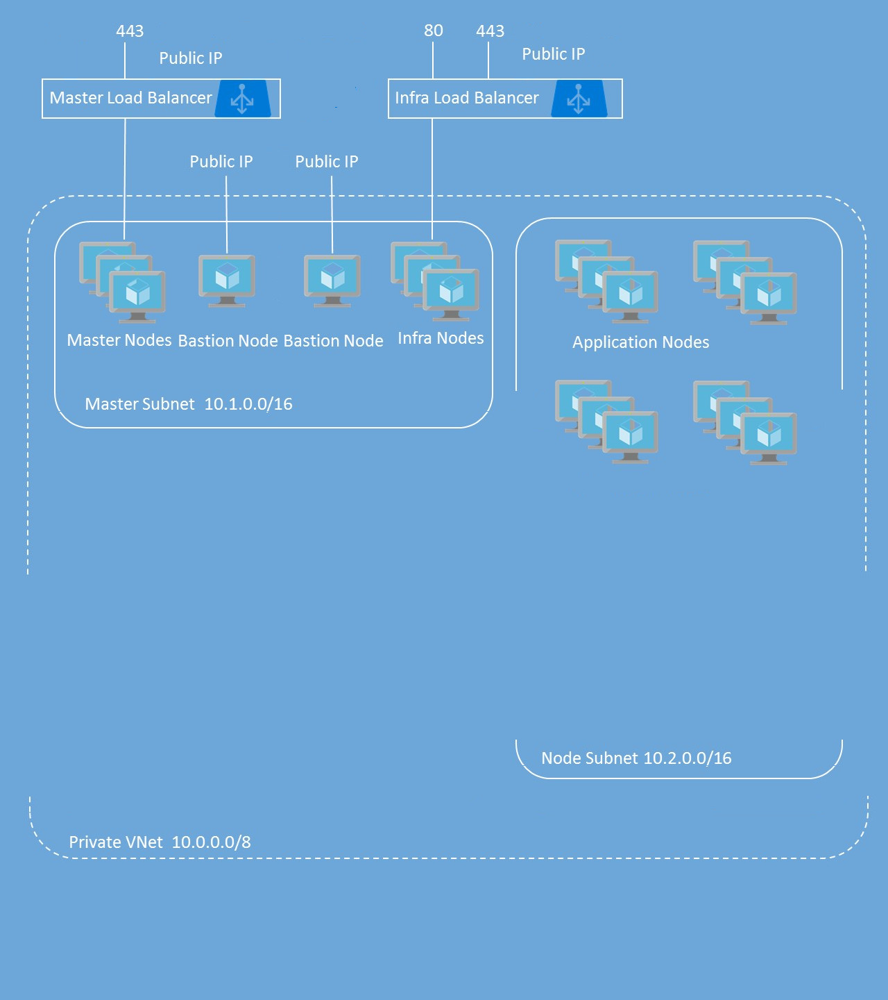

# openshift-azure-terraform - Release 3.9
OpenShift Container Platform on Azure deployment via Terraform

**For OpenShift Origin refer to https://github.com/heatmiser/origin-azure-terraform**

## OpenShift Container Platform 3.9 with Username / Password authentication for OpenShift

The OpenShift architecture provided by these Terraform templates is based on the architecture outlined by [this](https://github.com/Microsoft/openshift-container-platform/tree/release-3.9) Azure Quickstart Template. The Microsoft OCP ARM Template repo is forked [here](https://github.com/heatmiser/openshift-container-platform/tree/release-3.9/) with some minor changes and additions made, as the automation code located in the [scripts directory](https://github.com/heatmiser/openshift-container-platform/tree/release-3.9/scripts) is utilized by portions of these Terraform templates. Changes that occur to the Microsoft OCP ARM template and accompanying automation deployment scripts that occur over time are periodically merged and reflected here.

This project provides Terraform templating for deploying OpenShift Container Platform with basic username / password for authentication to OpenShift. It includes the following resources:

|Resource           	|Properties                                                                                                                          |
|-----------------------|------------------------------------------------------------------------------------------------------------------------------------|
|Virtual Network   		|**Address prefix:** 10.0.0.0/23<br />**Master subnet:** 10.0.0.0/24<br />**Node subnet:** 10.0.1.0/24<br />**CRS Gluster subnet:** 172.16.144.0/24  (optional)               |
|Master Load Balancer	|1 probe and 1 rule for TCP 443<br/>                                                                                |
|Infra Load Balancer	|2 probes and 2 rules for TCP 80 and TCP 443									                                           |
|Public IP Addresses	|Bastion Public IP for Bastion Node<br />OpenShift Master public IP attached to Master Load Balancer<br />OpenShift Router public IP attached to Infra Load Balancer<br />OpenVPN public IP for OpenVPN node (optional)    |
|Storage Accounts <br />Managed Disks      |2 Storage Accounts for Diagnostics Logs <br />1 Storage Account for Private Docker Registry |
|Network Security Groups|1 Network Security Group for Bastion VM<br />1 Network Security Group Master VMs<br />1 Network Security Group for Infra VMs<br />1 Network Security Group for Node VMs |
|Availability Sets      |1 Availability Set for Master VMs<br />1 Availability Set for Infra VMs<br />1 Availability Set for Node VMs  |
|Virtual Machines   	|1 Bastion Node - Used to Run Ansible Playbook for OpenShift deployment<br />3 or 5 Master Nodes<br />2 or 3 Infra Nodes<br />User-defined number of Nodes (1 to 30)<br />All VMs include a single attached data disk for container layerfs2 logical volume|



## READ the instructions in its entirety before deploying!

Additional documentation for deploying OpenShift in Azure can be found here: https://docs.microsoft.com/en-us/azure/virtual-machines/linux/openshift-get-started

These templates deploy multiple VMs and requires some pre-work before you can successfully deploy the OpenShift Cluster.  If you don't get the pre-work done correctly, you will most likely fail to deploy the cluster using these templates.  Please read the instructions completely before you proceed. 

These template utilize a custom Red Hat Enterprise Linux image built using Hashicorp's Packer utility for VM image building. Forthcoming additions will provide a means for selecting an On-Demand Red Hat Enterprise Linux image from the Azure Gallery as an alternative to building and deploying roll-your-own VM images. 
>If you use the On-Demand image, there is an hourly charge for using this image.  At the same time, the instance will be registered to your Red Hat subscription, so you will also be using one of your entitlements. This will lead to "double billing".  Utilizing the On-Demand image will cost more over time, however, getting up and running initially will be quicker as using On-Demand images negates the need to use Packer for base VM image creation.

After successful deployment, the Bastion Node is no longer required unless you want to use it to add nodes or run other playbooks in the future.  You can turn it off and delete it or keep it around for running future playbooks.  You can also use this as the jump host for managing your OpenShift cluster.

Optionally, you can choose to also deploy an OpenVPN node into the master subnet.  This will permit direct connections to all nodes within the cluster using actual node short hostnames, providing a bit of added convenience over a jump host.

Container Native Storage (CNS) and Container Ready Storage (CRS) options
TO-DO

## Prerequisites

In order to facillitate the deployment of OpenShift infrastructure and components on Azure, we are going to need the following account, tools, and utilities:
-   Azure user login with administrator role assigned
-   Azure CLI 2.0 utility  https://docs.microsoft.com/en-us/cli/azure/?view=azure-cli-latest
-   Terraform utility   https://www.terraform.io/
-   Packer utility    https://www.packer.io/
-   go-task utility  https://github.com/go-task/task
-   jq               https://stedolan.github.io/jq/

Utilizing a container-based environment to provide the above capabilities is recommended, either via the Azure Cloud Shell or via a local container, as the tools and utilities can be maintained and upgraded separately, while the OpenShift-Azure Terraform project folder and local scripts can be persisted across container versions through a separate volume storage mount.

For local containers, an Azure-CLI based container is a good start...
-   Official release based on Debian Jessie https://hub.docker.com/r/microsoft/azure-cli/
-   Developer builds based on Python 3 Alpine Linux image https://hub.docker.com/r/azuresdk/azure-cli-python/

Starting with a Dockerfile or other container image build script, the above list of tools and utilities can be included to build a container image that can then be upgraded/improved on an ongoing basis.  For the go-task utility, recommended to install 64-bit and 32-bit versions, rename as such and symlink to the 'task' the version that works without error, as some base container images might not provided requisite library support for some 64-bit binaries. 

TO-DO Include documentation and project files to provide support for helping users to quickly build their own Azure-CLI container images


### Generate SSH Keys

The included scripts provide a means for generating an SSH key pair (Public / Private) which will be used during the automated portions of these templates.  A passphrase is **NOT** utilized when generating the private key. <br/><br/>
If you are using a Windows computer, you can download puttygen.exe.  You will need to export to OpenSSH (from Conversions menu) to get a valid Private Key for use in the Template.<br/><br/>
From a Linux or Mac, you can just use the ssh-keygen command.  Once you are finished deploying the cluster, you can always generate new keys that uses a passphrase and replace the original ones used during initial deployment.

### Azure Key Vault for storing the SSH Private Key

The ARM template version provides a means for accessing stored Private SSH Keys via Azure Key Vault that will then be pulled down and accessed during deployment.  This is to provide security around the Private Key - especially since it does not have a passphrase.  As of version 0.11.7, Terraform supports creating Key Vaults and Key Vault Keys in Azure, however, it does not provide a means to access them, so currently all public/private key pairs are stored locally in the project directory. Adding support for utilizing Key Vaults and Key Vault Keys in Azure via Terraform is an upcoming feature addition to the project.

### Azure Active Directory Service Principal

To configure Azure as the Cloud Provider for OpenShift Container Platform, you will need to create an Azure Active Directory Service Principal.  The easiest way to perform this task is via the Azure CLI.  Below are the steps for doing this.

Assigning permissions to the entire Subscription is the easiest method but does give the Service Principal permissions to all resources in the Subscription.  Assigning permissions to only the Resource Group is the most secure as the Service Principal is restricted to only that one Resource Group. 
   
**Azure CLI 2.0**

1. **Create Service Principal and assign permissions to Subscription**<br/>
  a.  az ad sp create-for-rbac -n \<friendly name\> --password \<password\> --role contributor --scopes /subscriptions/\<subscription_id\><br/>
      Ex: `az ad sp create-for-rbac -n openshiftcloudprovider --password Pass@word1 --role contributor --scopes /subscriptions/555a123b-1234-5ccc-defgh-6789abcdef01`<br/>

2. **Create Service Principal and assign permissions to Resource Group**<br/>
  a.  If you use this option, you must have created the Resource Group first.  Be sure you don't create any resources in this Resource Group before deploying the cluster.<br/>
  b.  az ad sp create-for-rbac -n \<friendly name\> --password \<password\> --role contributor --scopes /subscriptions/\<subscription_id\>/resourceGroups/\<Resource Group Name\><br/>
      Ex: `az ad sp create-for-rbac -n openshiftcloudprovider --password Pass@word1 --role contributor --scopes /subscriptions/555a123b-1234-5ccc-defgh-6789abcdef01/resourceGroups/00000test`<br/>

3. **Create Service Principal without assigning permissions to Resource Group**<br/>
  a.  If you use this option, you will need to assign permissions to either the Subscription or the newly created Resource Group shortly after you initiate the deployment of the cluster or the post installation scripts will fail when configuring Azure as the Cloud Provider.<br/>
  b.  az ad sp create-for-rbac -n \<friendly name\> --password \<password\> --role contributor --skip-assignment<br/>
      Ex: `az ad sp create-for-rbac -n openshiftcloudprovider --password Pass@word1 --role contributor --skip-assignment`<br/>

You will get an output similar to:

```javascript
{
  "appId": "2c8c6a58-44ac-452e-95d8-a790f6ade583",
  "displayName": "openshiftcloudprovider",
  "name": "http://openshiftcloudprovider",
  "password": "Pass@word1",
  "tenant": "12a345bc-1234-dddd-12ab-34cdef56ab78"
}
```

The appId is used for the aadClientId parameter.


### Red Hat Subscription Access

For security reasons, the method for registering the RHEL system has been changed to allow the use of an Organization ID and Activation Key as well as a Username and Password. Please know that it is more secure to use the Organization ID and Activation Key.

You can determine your Organization ID by running ```subscription-manager identity``` on a registered machine.  To create or find your Activation Key, please go here: https://access.redhat.com/management/activation_keys.

You will also need to get the Pool ID that contains your entitlements for OpenShift.  You can retrieve this from the Red Hat portal by examining the details of the subscription that has the OpenShift entitlements.  Or you can contact your Red Hat administrator to help you.

### variable files *.tfvars explained

1.  _artifactsLocation: URL for artifacts (json, scripts, etc.)
2.  masterVmSize: Size of the Master VM. Select from one of the allowed VM sizes listed in the azuredeploy.json file
3.  infraVmSize: Size of the Infra VM. Select from one of the allowed VM sizes listed in the azuredeploy.json file
3.  nodeVmSize: Size of the App Node VM. Select from one of the allowed VM sizes listed in the azuredeploy.json file
4.  storageKind: The type of storage to be used. Value is either "managed" or "unmanaged"
4.  openshiftClusterPrefix: Cluster Prefix used to configure hostnames for all nodes - bastion, master, infra and app nodes. Between 1 and 20 characters
7.  masterInstanceCount: Number of Masters nodes to deploy
8.  infraInstanceCount: Number of infra nodes to deploy
8.  nodeInstanceCount: Number of Nodes to deploy
9.  dataDiskSize: Size of data disk to attach to nodes for Docker volume - valid sizes are 32 GB, 64 GB, 128 GB, 256 GB, 512 GB, 1024 GB, and 2048 GB
10. adminUsername: Admin username for both OS (VM) login and initial OpenShift user
11. openshiftPassword: Password for OpenShift user and root user
11. enableMetrics: Enable Metrics - value is either "true" or "false"
11. enableLogging: Enable Logging - value is either "true" or "false"
12. rhsmUsernameOrOrgId: Red Hat Subscription Manager Username or Organization ID. To find your Organization ID, run on registered server: `subscription-manager identity`.
13. rhsmPasswordOrActivationKey: Red Hat Subscription Manager Password or Activation Key for your Cloud Access subscription. You can get this from [here](https://access.redhat.com/management/activation_keys).
14. rhsmPoolId: The Red Hat Subscription Manager Pool ID that contains your OpenShift entitlements
15. sshPublicKey: Copy your SSH Public Key here
16. keyVaultResourceGroup: The name of the Resource Group that contains the Key Vault
17. keyVaultName: The name of the Key Vault you created
18. keyVaultSecret: The Secret Name you used when creating the Secret (that contains the Private Key)
18. enableAzure: Enable Azure Cloud Provider - value is either "true" or "false"
18. aadClientId: Azure Active Directory Client ID also known as Application ID for Service Principal
18. aadClientSecret: Azure Active Directory Client Secret for Service Principal
19. defaultSubDomainType: This will either be nipio (if you don't have your own domain) or custom if you have your own domain that you would like to use for routing
20. defaultSubDomain: The wildcard DNS name you would like to use for routing if you selected custom above.  If you selected nipio above, you must still enter something here but it will not be used

## Deploying Templates

Once you have collected all of the prerequisites for the template, you can deploy the template by clicking Deploy to Azure or populating the **azuredeploy.parameters.json** file and executing Resource Manager deployment commands with PowerShell or the Azure CLI.

**Azure CLI 2.0**

1. Create Resource Group: az group create -n \<name\> -l \<location\><br />
Ex: `az group create -n openshift-cluster -l westus`
2. Create Resource Group Deployment: az group deployment create --name \<deployment name\> --template-file \<template_file\> --parameters @\<parameters_file\> --resource-group \<resource group name\> --nowait<br />
Ex: `az group deployment create --name ocpdeployment --template-file azuredeploy.json --parameters @azuredeploy.parameters.json --resource-group openshift-cluster --no-wait`


### NOTE

The OpenShift Ansible playbook does take a while to run when using VMs backed by Standard Storage. VMs backed by Premium Storage are faster. If you want Premium Storage, select a DS, or GS series VM.
<hr />

Be sure to follow the OpenShift instructions to create the necessary DNS entry for the OpenShift Router for access to applications. <br />


### TROUBLESHOOTING

If you encounter an error during deployment of the cluster, please view the deployment status.  The following Error Codes will help to narrow things down.

1.  Exit Code 3:  Your Red Hat Subscription User Name / Password or Organization ID / Activation Key is incorrect
2.  Exit Code 4:  Your Red Hat Pool ID is incorrect or there are no entitlements available
3.  Exit Code 5:  Unable to provision Docker Thin Pool Volume
4.  Exit Code 6:  OpenShift Cluster installation failed
5.  Exit Code 7:  OpenShift Cluster installation succeeded but Azure Cloud Provider configuration failed - master config on Master Node issue
6.  Exit Code 8:  OpenShift Cluster installation succeeded but Azure Cloud Provider configuration failed - node config on Master Node issue
7.  Exit Code 9:  OpenShift Cluster installation succeeded but Azure Cloud Provider configuration failed - node config on Infra or App Node issue
8.  Exit Code 10: OpenShift Cluster installation succeeded but Azure Cloud Provider configuration failed - correcting Master Nodes or not able to set Master as unschedulable
9.  Exit Code 11: Metrics failed to deploy
10. Exit Code 12: Logging failed to deploy

For Exit Codes 7 - 10, the OpenShift Cluster did install but the Azure Cloud Provider configuration failed.  You can SSH to the Bastion node and from there SSH to each of the nodes in the cluster and fix the issues.

A common cause for the failures with Exit Codes 7 - 9 is the Service Principal did not have proper permissions to the Subscription or the Resource Group.  If this is indeed the issue, then assign the correct permissions and manually re-run the script that failed an all subsequent scripts.  Be sure to restart the service that failed (e.g. systemctl restart atomic-openshift-node.service) before executing the scripts again.


For further troubleshooting, please SSH into your Bastion node on port 22.  You will need to be root **(sudo su -)** and then navigate to the following directory: **/var/lib/waagent/custom-script/download**<br/><br/>
You should see a folder named '0' and '1'.  In each of these folders, you will see two files, stderr and stdout.  You can look through these files to determine where the failure occurred.

## Post-Deployment Operations

### Metrics and logging

**Metrics**

If you deployed Metrics, it will take a few extra minutes deployment to complete. Please be patient.

Once the deployment is complete, log into the OpenShift Web Console and complete an addition configuration step.  Go to the openshift-infra project, click on Hawkster metrics route, and accept the SSL exception in your browser.

**Logging**

If you deployed Logging, it will take a few extra minutes deployment to complete. Please be patient.

Once the deployment is complete, log into the OpenShift Web Console and complete an addition configuration step.  Go to the logging project, click on the Kubana route, and accept the SSL exception in your browser.

### Creation of additional users

To create additional (non-admin) users in your environment, login to your master server(s) via SSH and run:
<br><i>htpasswd /etc/origin/master/htpasswd mynewuser</i>

### Additional OpenShift Configuration Options
 
You can configure additional settings per the official (<a href="https://docs.openshift.com/container-platform/3.9/welcome/index.html" target="_blank">OpenShift Enterprise Documentation</a>).
